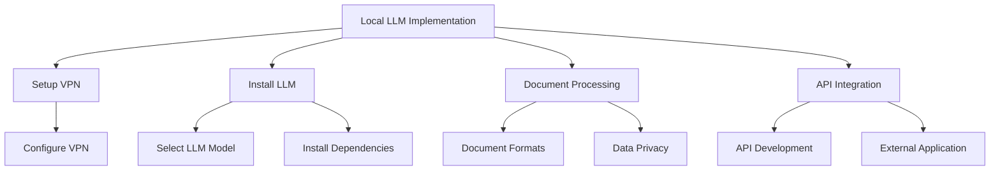

# Overview Diagram in Mermaid Language

### Step-by-Step Guide to Implement Local LLM

# Step-by-Step Guide to Implement Local LLM

## Step 1: Setup VPN
1. **Configure VPN**: Ensure all network traffic is routed through the VPN to maintain data privacy.
2. **Restrict External Access**: Configure firewall rules to prevent the LLM from accessing the internet.

## Step 2: Install LLM
1. **Select LLM Model**: Choose a suitable model (e.g., GPT-4, BERT) based on your requirements.
2. **Install Dependencies**: Set up necessary libraries and frameworks (e.g., TensorFlow, PyTorch).

## Step 3: Document Processing
1. **Document Formats**: Ensure the LLM can handle various formats (Word, PDF, Excel, CSV, PowerPoint, PNG, JPG).
2. **Data Privacy**: Implement encryption and access control to protect sensitive data.

## Step 4: API Integration
1. **API Development**: Develop an API to interact with the LLM.
2. **External Application**: Connect the API to external applications for seamless interaction.

### Technologies and Models
- **VPN**: OpenVPN, WireGuard
- **LLM Models**: GPT-4, BERT
- **Frameworks**: TensorFlow, PyTorch
- **API Development**: Flask, FastAPI

### Explanation
- **VPN**: Ensures secure communication and data privacy.
- **LLM Models**: GPT-4 for general-purpose tasks, BERT for specific NLP tasks.
- **Frameworks**: TensorFlow and PyTorch are widely used for machine learning and deep learning.
- **API Development**: Flask and FastAPI are lightweight and efficient for developing APIs.

# Advantages of Local LLM vs Cloud LLM

## Local LLM
1. **Data Privacy**: Ensures sensitive data remains within the local network.
2. **Control**: Full control over the LLM and its environment.
3. **Customization**: Ability to tailor the LLM to specific needs and requirements.
4. **Latency**: Reduced latency as data does not need to travel over the internet.

## Cloud LLM
1. **Scalability**: Easily scalable to handle large workloads.
2. **Maintenance**: Managed by cloud providers, reducing the need for local maintenance.
3. **Accessibility**: Accessible from anywhere with an internet connection.
4. **Cost**: Potentially lower upfront costs, but ongoing subscription fees.

## Conclusion
Choosing between a Local LLM and a Cloud LLM depends on your specific needs. For sensitive data and privacy concerns, a Local LLM is preferable. For scalability and ease of maintenance, a Cloud LLM might be more suitable.

**Answer prompt 2**

Absolutely! Let's dive deeper into the process of implementing a Local LLM, ensuring data privacy, handling various document formats, and integrating with an API. I'll cover each step in detail, including the technologies involved and how models can be fine-tuned.

# Step-by-Step Guide to Implement Local LLM
## Step 1: Setup VPN
**Configure VPN:**

Technology: OpenVPN or WireGuard.

Process: Install and configure the VPN server on your local network. Ensure all devices that will interact with the LLM are connected to this VPN.

Source: OpenVPN and WireGuard.

Purpose: This ensures that all data traffic is encrypted and remains within the local network, preventing external access.

**Restrict External Access:**

Technology: Firewall rules.

Process: Configure firewall settings to block any outgoing connections from the LLM server to the internet.

Source: Firewall Configuration Guide.

Purpose: Ensures the LLM cannot access external networks, maintaining data privacy.

## Step 2: Install LLM

**Select LLM Model:**

Technology: GPT-4, BERT, or LLaMA.

Process: Choose a model based on your specific needs. GPT-4 is suitable for general-purpose tasks, while BERT is optimized for specific NLP tasks.

Source: Hugging Face for model selection.

Purpose: Different models have different strengths; selecting the right one ensures optimal performance for your use case.

**Install Dependencies:**

Technology: TensorFlow, PyTorch.

Process: Install necessary libraries and frameworks using package managers like pip.

Source: TensorFlow Installation and PyTorch Installation.

Purpose: These frameworks provide the tools needed to run and train LLMs.

## Step 3: Document Processing

**Document Formats:**

Technology: Libraries for handling various formats (e.g., PyMuPDF for PDFs, Pandas for CSVs, OpenCV for images).

Process: Install and configure libraries to read and process documents in different formats.

Source: PyMuPDF, Pandas, OpenCV.

Purpose: Ensures the LLM can handle and extract information from various document types.

**Data Privacy:**

Technology: Encryption and access control mechanisms.

Process: Implement encryption for stored documents and set up access control to restrict who can view or modify the data.

Source: Encryption Guide and Access Control.

Purpose: Protects sensitive data from unauthorized access.

## Step 4: API Integration

**API Development:**

Technology: Flask, FastAPI.

Process: Develop an API to interact with the LLM using these frameworks.

Source: Flask and FastAPI.

Purpose: Provides a way for external applications to interact with the LLM securely.

**External Application:**

Technology: Integration tools like Apidog.

Process: Connect the API to external applications, ensuring secure and efficient communication.

Source: Apidog.

Purpose: Enables seamless interaction with the LLM from external systems.

### Fine-Tuning LLM Models

**Data Preparation:**

Technology: Data preprocessing tools (e.g., NLTK, SpaCy).

Process: Clean and preprocess the data to be used for fine-tuning.

Source: NLTK and SpaCy.

Purpose: Ensures the data is in a suitable format for training.

**Choosing the Right Pre-trained Model:**

Technology: Pre-trained models from Hugging Face.

Process: Select a model that closely matches your domain or task.

Source: Hugging Face Model Hub.

Purpose: Starting with a pre-trained model reduces the amount of data and time needed for fine-tuning.

**Identifying the Right Parameters for Fine-Tuning:**

Technology: Hyperparameter tuning tools (e.g., Optuna).

Process: Experiment with different hyperparameters to find the optimal settings.

Source: Optuna.

Purpose: Optimizes the model's performance for your specific task.

**Validation:**

Technology: Validation techniques (e.g., cross-validation).

Process: Validate the model using a separate dataset to ensure it generalizes well.

Source: Cross-Validation Guide.

Purpose: Ensures the model performs well on unseen data.

**Model Iteration:**

Technology: Iterative training processes.

Process: Continuously improve the model by retraining with new data and adjusting parameters.

Source: Iterative Training.

Purpose: Enhances the model's accuracy and performance over time.

**Model Deployment:**

Technology: Deployment tools (e.g., Docker, Kubernetes).

Process: Deploy the fine-tuned model in a production environment.

Source: Docker and Kubernetes.

Purpose: Ensures the model is accessible and scalable in real-world applications.

## Conclusion
Implementing a Local LLM involves setting up a secure environment, installing and configuring the model, processing various document formats, and integrating with external applications. Fine-tuning the model ensures it performs optimally for your specific tasks. By following these steps and using the recommended technologies, you can create a powerful and secure Local LLM solution.